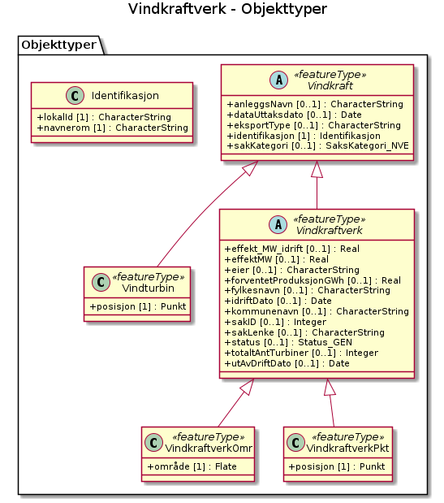

# Produktspesifikasjon: Vindkraftverk

## Innledning, historikk og endringslogg

### Innledning
Datasettet over Norges fylker og kommuner er utarbeidet for å vise de offisielle administrative
grensene i landet.

### Historikk

### Endringslogg

### Normative referanser

## Definisjoner og forkortelser

### Definisjoner

### Forkortelser
DEK: Digitalt EiendomsKart

EPSG: European Petroleum Survey Group

GML: Geographic Markup Language

ISO: International Standardization Organization

OGP: The international Association of Oil and Gas Producers

SOSI: Samordnet Opplegg for Stedfestet Informasjon

UML: Unified Modeling Language

XML: Extensible Markup Language

XSD: XML Schema Definition

ØK: Økonomisk kartverk

## Generelt om spesifikasjonen

### Unik identifisering

ac249604-cd82-490c-83cc-9cd24fe18088

#### Fullstendig navn

Vindkraftverk

#### Versjon

2004-11-01

### Referansedato

### Ansvarlig organisasjon

Norges vassdrags- og energidirektorat

### Språk

nor

### Hovedtema

vindkraftverk, vindmøller, kraftanlegg, ND_DS, vindturbiner, Norge fastland, Annet, geodataloven, Det offentlige kartgrunnlaget, Norge digitalt, modellbaserteVegprosjekter, fellesDatakatalog, Energi

### Temakategori

Miljødata

### Sammendrag

Datasettet gir en samlet  oversikt over konsesjonspliktige vindkraftverk som NVE har ferdigbehandlet eller som er under behandling. Dataene gir også en oversikt over konsesjonspliktige vindkraftverk som er helt eller delvis bygget og idriftsatt.

### Formål

## Spesifikasjonsomfang

**Nivå**: dataset

**Utstrekning**:

- **tidsmessig**: - **intervall**: - 2004-11-01, 2004-11-01

**Juridiske begrensninger**:

- **Bruksbegrensninger**: Ingen
- **Tilgangsbegrensninger**: Åpne data
- **Bruksbegrensninger**: Lisens
- **Lisens**: Norsk lisens for offentlige data (NLOD)
- **Lisenslenke**: <http://data.norge.no/nlod/no/1.0>
- **Sikkerhetsbegrensninger**: Ugradert

## Innhold og struktur

**Bruk**: NVE fraskriver seg ansvar for skade som skyldes feil i data og feil bruk av data.

### Datamodell

#### VindkraftverkOmr

Vindparkområder med yttergrense for konsesjonssøkte og utbygde vindkraftverk

Geometri:
- type: Flate

Egenskaper

<table class="feature-attribute-table">
  <colgroup>
    <col style="width: 35%;" />
    <col style="width: 65%;" />
  </colgroup>
  <tbody>
    <tr>
      <th scope="row">Navn:</th>
      <td><strong>geometry</strong></td>
    </tr>
    <tr>
      <th scope="row">Type:</th>
      <td>Flate</td>
    </tr>
    <tr>
      <th scope="row">OGC-rolle:</th>
      <td>primary-geometry</td>
    </tr>
  </tbody>
</table>

Relasjoner

**Arv**
Vindkraftverk

#### Vindturbin

Vindturbiner, knyttet til konsesjonssøkte og utbygde vindkraftverk

Egenskaper

<table class="feature-attribute-table">
  <colgroup>
    <col style="width: 35%;" />
    <col style="width: 65%;" />
  </colgroup>
  <tbody>
    <tr>
      <th scope="row">Navn:</th>
      <td><strong>posisjon</strong></td>
    </tr>
    <tr>
      <th scope="row">Definisjon:</th>
      <td>egenskap som inneholder objektets geometri</td>
    </tr>
    <tr>
      <th scope="row">Multiplisitet:</th>
      <td>1</td>
    </tr>
    <tr>
      <th scope="row">Type:</th>
      <td>Punkt</td>
    </tr>
  </tbody>
</table>

Relasjoner

**Arv**
Vindkraft

#### VindkraftverkPkt

Konsesjonssøkte og utbygde vindkraftverk, med representasjonspunkt

Egenskaper

<table class="feature-attribute-table">
  <colgroup>
    <col style="width: 35%;" />
    <col style="width: 65%;" />
  </colgroup>
  <tbody>
    <tr>
      <th scope="row">Navn:</th>
      <td><strong>posisjon</strong></td>
    </tr>
    <tr>
      <th scope="row">Definisjon:</th>
      <td>egenskap som inneholder objektets geometri</td>
    </tr>
    <tr>
      <th scope="row">Multiplisitet:</th>
      <td>1</td>
    </tr>
    <tr>
      <th scope="row">Type:</th>
      <td>Punkt</td>
    </tr>
  </tbody>
</table>

Relasjoner

**Arv**
Vindkraftverk

#### Vindkraft (abstrakt)

Felles for vindkraft

Egenskaper

<table class="feature-attribute-table">
  <colgroup>
    <col style="width: 35%;" />
    <col style="width: 65%;" />
  </colgroup>
  <tbody>
    <tr>
      <th scope="row">Navn:</th>
      <td><strong>anleggsNavn</strong></td>
    </tr>
    <tr>
      <th scope="row">Definisjon:</th>
      <td>Navn på anlegget i NVEs konsesjonsregister.</td>
    </tr>
    <tr>
      <th scope="row">Multiplisitet:</th>
      <td>0..1</td>
    </tr>
    <tr>
      <th scope="row">Type:</th>
      <td>CharacterString</td>
    </tr>
  </tbody>
</table>

<table class="feature-attribute-table">
  <colgroup>
    <col style="width: 35%;" />
    <col style="width: 65%;" />
  </colgroup>
  <tbody>
    <tr>
      <th scope="row">Navn:</th>
      <td><strong>dataUttaksdato</strong></td>
    </tr>
    <tr>
      <th scope="row">Definisjon:</th>
      <td>Dato for uttak av dataene fra NVEs database.</td>
    </tr>
    <tr>
      <th scope="row">Multiplisitet:</th>
      <td>0..1</td>
    </tr>
    <tr>
      <th scope="row">Type:</th>
      <td>DateTime</td>
    </tr>
  </tbody>
</table>

<table class="feature-attribute-table">
  <colgroup>
    <col style="width: 35%;" />
    <col style="width: 65%;" />
  </colgroup>
  <tbody>
    <tr>
      <th scope="row">Navn:</th>
      <td><strong>eksportType</strong></td>
    </tr>
    <tr>
      <th scope="row">Definisjon:</th>
      <td>Hvordan dataene ble hentet ut fra NVEs databaser.</td>
    </tr>
    <tr>
      <th scope="row">Multiplisitet:</th>
      <td>0..1</td>
    </tr>
    <tr>
      <th scope="row">Type:</th>
      <td>CharacterString</td>
    </tr>
  </tbody>
</table>

<table class="feature-attribute-table">
  <colgroup>
    <col style="width: 35%;" />
    <col style="width: 65%;" />
  </colgroup>
  <tbody>
    <tr>
      <th scope="row">Navn:</th>
      <td><strong>identifikasjon</strong></td>
    </tr>
    <tr>
      <th scope="row">Definisjon:</th>
      <td>Unik ID for objektet. Id-en er unik innenfor NVE's databaser</td>
    </tr>
    <tr>
      <th scope="row">Multiplisitet:</th>
      <td>1</td>
    </tr>
    <tr>
      <th scope="row">Type:</th>
      <td>Identifikasjon</td>
    </tr>
  </tbody>
</table>

<table class="feature-attribute-table">
  <colgroup>
    <col style="width: 35%;" />
    <col style="width: 65%;" />
  </colgroup>
  <tbody>
    <tr>
      <th scope="row">Navn:</th>
      <td><strong>identifikasjon.lokalId</strong></td>
    </tr>
    <tr>
      <th scope="row">Definisjon:</th>
      <td>lokal identifikator av et objekt  Merknad: Det er dataleverendørens ansvar å sørge for at den lokale identifikatoren er unik innenfor navnerommet.</td>
    </tr>
    <tr>
      <th scope="row">Multiplisitet:</th>
      <td>1</td>
    </tr>
    <tr>
      <th scope="row">Type:</th>
      <td>CharacterString</td>
    </tr>
  </tbody>
</table>

<table class="feature-attribute-table">
  <colgroup>
    <col style="width: 35%;" />
    <col style="width: 65%;" />
  </colgroup>
  <tbody>
    <tr>
      <th scope="row">Navn:</th>
      <td><strong>identifikasjon.navnerom</strong></td>
    </tr>
    <tr>
      <th scope="row">Definisjon:</th>
      <td>navnerom som unikt identifiserer datakilden til et objekt, anbefales å være en http-URI  Eksempel: <a href="http://data.geonorge.no/SentraltStedsnavnsregister/1.0">http://data.geonorge.no/SentraltStedsnavnsregister/1.0</a>  Merknad : Verdien for nanverom vil eies av den dataprodusent som har ansvar for de unike identifikatorene og må være registrert i data.geonorge.no eller data.norge.no</td>
    </tr>
    <tr>
      <th scope="row">Multiplisitet:</th>
      <td>1</td>
    </tr>
    <tr>
      <th scope="row">Type:</th>
      <td>CharacterString</td>
    </tr>
  </tbody>
</table>

<table class="feature-attribute-table">
  <colgroup>
    <col style="width: 35%;" />
    <col style="width: 65%;" />
  </colgroup>
  <tbody>
    <tr>
      <th scope="row">Navn:</th>
      <td><strong>sakKategori</strong></td>
    </tr>
    <tr>
      <th scope="row">Definisjon:</th>
      <td>Konsesjonsstadium.</td>
    </tr>
    <tr>
      <th scope="row">Multiplisitet:</th>
      <td>0..1</td>
    </tr>
    <tr>
      <th scope="row">Type:</th>
      <td>SaksKategori_NVE</td>
    </tr>
  </tbody>
</table>

#### Vindkraftverk (abstrakt)

Felles for vindkraftverk

Egenskaper

<table class="feature-attribute-table">
  <colgroup>
    <col style="width: 35%;" />
    <col style="width: 65%;" />
  </colgroup>
  <tbody>
    <tr>
      <th scope="row">Navn:</th>
      <td><strong>effekt_MW_idrift</strong></td>
    </tr>
    <tr>
      <th scope="row">Definisjon:</th>
      <td>Installert effekt i MW</td>
    </tr>
    <tr>
      <th scope="row">Multiplisitet:</th>
      <td>0..1</td>
    </tr>
    <tr>
      <th scope="row">Type:</th>
      <td>Real</td>
    </tr>
  </tbody>
</table>

<table class="feature-attribute-table">
  <colgroup>
    <col style="width: 35%;" />
    <col style="width: 65%;" />
  </colgroup>
  <tbody>
    <tr>
      <th scope="row">Navn:</th>
      <td><strong>effektMW</strong></td>
    </tr>
    <tr>
      <th scope="row">Definisjon:</th>
      <td>Omsøkt eller konsesjonsgitt installert effekt i MW .</td>
    </tr>
    <tr>
      <th scope="row">Multiplisitet:</th>
      <td>0..1</td>
    </tr>
    <tr>
      <th scope="row">Type:</th>
      <td>Real</td>
    </tr>
  </tbody>
</table>

<table class="feature-attribute-table">
  <colgroup>
    <col style="width: 35%;" />
    <col style="width: 65%;" />
  </colgroup>
  <tbody>
    <tr>
      <th scope="row">Navn:</th>
      <td><strong>eier</strong></td>
    </tr>
    <tr>
      <th scope="row">Definisjon:</th>
      <td>Selskap som søker/har konsesjon.</td>
    </tr>
    <tr>
      <th scope="row">Multiplisitet:</th>
      <td>0..1</td>
    </tr>
    <tr>
      <th scope="row">Type:</th>
      <td>CharacterString</td>
    </tr>
  </tbody>
</table>

<table class="feature-attribute-table">
  <colgroup>
    <col style="width: 35%;" />
    <col style="width: 65%;" />
  </colgroup>
  <tbody>
    <tr>
      <th scope="row">Navn:</th>
      <td><strong>forventetProduksjonGWh</strong></td>
    </tr>
    <tr>
      <th scope="row">Definisjon:</th>
      <td>Forventet produksjon ved anlegget (GWh).</td>
    </tr>
    <tr>
      <th scope="row">Multiplisitet:</th>
      <td>0..1</td>
    </tr>
    <tr>
      <th scope="row">Type:</th>
      <td>Real</td>
    </tr>
  </tbody>
</table>

<table class="feature-attribute-table">
  <colgroup>
    <col style="width: 35%;" />
    <col style="width: 65%;" />
  </colgroup>
  <tbody>
    <tr>
      <th scope="row">Navn:</th>
      <td><strong>fylkesnavn</strong></td>
    </tr>
    <tr>
      <th scope="row">Definisjon:</th>
      <td>Navn på (hoved)fylket anlegget ligger i.</td>
    </tr>
    <tr>
      <th scope="row">Multiplisitet:</th>
      <td>0..1</td>
    </tr>
    <tr>
      <th scope="row">Type:</th>
      <td>CharacterString</td>
    </tr>
  </tbody>
</table>

<table class="feature-attribute-table">
  <colgroup>
    <col style="width: 35%;" />
    <col style="width: 65%;" />
  </colgroup>
  <tbody>
    <tr>
      <th scope="row">Navn:</th>
      <td><strong>idriftDato</strong></td>
    </tr>
    <tr>
      <th scope="row">Definisjon:</th>
      <td>Dato for idriftsettelse av anlegget.</td>
    </tr>
    <tr>
      <th scope="row">Multiplisitet:</th>
      <td>0..1</td>
    </tr>
    <tr>
      <th scope="row">Type:</th>
      <td>DateTime</td>
    </tr>
  </tbody>
</table>

<table class="feature-attribute-table">
  <colgroup>
    <col style="width: 35%;" />
    <col style="width: 65%;" />
  </colgroup>
  <tbody>
    <tr>
      <th scope="row">Navn:</th>
      <td><strong>kommunenavn</strong></td>
    </tr>
    <tr>
      <th scope="row">Definisjon:</th>
      <td>Navn på (hoved)kommunen anlegget ligger i.</td>
    </tr>
    <tr>
      <th scope="row">Multiplisitet:</th>
      <td>0..1</td>
    </tr>
    <tr>
      <th scope="row">Type:</th>
      <td>CharacterString</td>
    </tr>
  </tbody>
</table>

<table class="feature-attribute-table">
  <colgroup>
    <col style="width: 35%;" />
    <col style="width: 65%;" />
  </colgroup>
  <tbody>
    <tr>
      <th scope="row">Navn:</th>
      <td><strong>sakID</strong></td>
    </tr>
    <tr>
      <th scope="row">Definisjon:</th>
      <td>ID i NVEs konsesjonsregister.</td>
    </tr>
    <tr>
      <th scope="row">Multiplisitet:</th>
      <td>0..1</td>
    </tr>
    <tr>
      <th scope="row">Type:</th>
      <td>Integer</td>
    </tr>
  </tbody>
</table>

<table class="feature-attribute-table">
  <colgroup>
    <col style="width: 35%;" />
    <col style="width: 65%;" />
  </colgroup>
  <tbody>
    <tr>
      <th scope="row">Navn:</th>
      <td><strong>sakLenke</strong></td>
    </tr>
    <tr>
      <th scope="row">Definisjon:</th>
      <td>URL-lenke til NVEs konsesjonsside for vindkraftanlegget.</td>
    </tr>
    <tr>
      <th scope="row">Multiplisitet:</th>
      <td>0..1</td>
    </tr>
    <tr>
      <th scope="row">Type:</th>
      <td>CharacterString</td>
    </tr>
  </tbody>
</table>

<table class="feature-attribute-table">
  <colgroup>
    <col style="width: 35%;" />
    <col style="width: 65%;" />
  </colgroup>
  <tbody>
    <tr>
      <th scope="row">Navn:</th>
      <td><strong>status</strong></td>
    </tr>
    <tr>
      <th scope="row">Definisjon:</th>
      <td>Anleggsstatus, for eksempel i drift, planlagt, nedlagt, osv.</td>
    </tr>
    <tr>
      <th scope="row">Multiplisitet:</th>
      <td>0..1</td>
    </tr>
    <tr>
      <th scope="row">Type:</th>
      <td>Status_GEN</td>
    </tr>
  </tbody>
</table>

<table class="feature-attribute-table">
  <colgroup>
    <col style="width: 35%;" />
    <col style="width: 65%;" />
  </colgroup>
  <tbody>
    <tr>
      <th scope="row">Navn:</th>
      <td><strong>totaltAntTurbiner</strong></td>
    </tr>
    <tr>
      <th scope="row">Definisjon:</th>
      <td>Antall turbiner.</td>
    </tr>
    <tr>
      <th scope="row">Multiplisitet:</th>
      <td>0..1</td>
    </tr>
    <tr>
      <th scope="row">Type:</th>
      <td>Integer</td>
    </tr>
  </tbody>
</table>

<table class="feature-attribute-table">
  <colgroup>
    <col style="width: 35%;" />
    <col style="width: 65%;" />
  </colgroup>
  <tbody>
    <tr>
      <th scope="row">Navn:</th>
      <td><strong>utAvDriftDato</strong></td>
    </tr>
    <tr>
      <th scope="row">Definisjon:</th>
      <td>Dato for når anlegget ble tatt ut av drift.</td>
    </tr>
    <tr>
      <th scope="row">Multiplisitet:</th>
      <td>0..1</td>
    </tr>
    <tr>
      <th scope="row">Type:</th>
      <td>DateTime</td>
    </tr>
  </tbody>
</table>

Relasjoner

**Arv**
Vindkraft

## Referansesystem

**Romlig representasjonstype**: Vektor

## Kvalitet

**Nivå**: dataset

- **navn**: Prosentvis oppfyllelse av FAIR-prinsipper
  **Måleparameter**: Angir fullstendighet i forhold til krav fra FAIR-prinsippene (The FAIR Guiding Principles for scientific data management and stewardship)
  **Resultat**: 66

- **navn**: FAIR
  **Resultat**: Prosentvis oppfyllelse av FAIR-prinsipper: 66%

**Beskrivelse**:
Database som inneholder vindmøller/vindkraftparker. Egenskapsdata er navn på mølle/park, navn på eier og status.
Se NVEs hjemmesider for mer informasjon om hvordan man tar hensyn til energianlegg i arealplaner:
<https://www.nve.no/flaum-og-skred/arealplanlegging/energianlegg-i-arealplanlegging/?ref=mainmenu>

## Datafangst

## Datavedlikehold

**Vedlikeholdsfrekvens**: Kontinuerlig

**Vedlikeholdsnotat**: NVE fraskriver seg ansvar for skade som skyldes feil i data og feil bruk av data.

## Presentasjon

**Tegnforklaring**:
<https://register.geonorge.no/register/versjoner/tegneregler/norges-vassdrags-og-energidirektorat/vindkraftverk>

## Leveranse

**Distribusjoner**:

- **format**: - **format**: WWW:DOWNLOAD-1.0-http--download
  **tilgang**:

  - **lenke**: <https://nedlasting.nve.no/gis>
  - **protokoll**: WWW:DOWNLOAD-1.0-http--download

- **tittel**: Egen nedlastningsside
  **format**: - **format**: Egen nedlastningsside
  **tilgang**:

  - **lenke**: <https://nedlasting.nve.no/gis>
  - **protokoll**: WWW:DOWNLOAD-1.0-http--download

- **tittel**: Vindkraftverk WMS
  **format**: - **format**: WMS
  **tilgang**:

  - **lenke**: <https://nve.geodataonline.no/arcgis/services/Vindkraft2/MapServer/WmsServer?request=GetCapabilities&service=WMS>
  - **protokoll**: WMS-tjeneste
  - **Lisens**: Åpne data
  **Notater**: Tjeneste

## Metadata

**Standard**: ISO19115

**Standardversjon**: 2003

**Metadatadato**: 2025-08-20

**språk**: nor

**Kontaktpunkt**:

- **organisasjon**: Norges vassdrags- og energidirektorat
- **epost**: yaa@nve.no
- **rolle**: pointOfContact

**Identifikatorer**:

- **Utsteder**: geonorge
  **kode**: ac249604-cd82-490c-83cc-9cd24fe18088

**Metadatalenke**:
<https://www.geonorge.no/geonetwork/srv/nor/csw?service=CSW&request=GetRecordById&version=2.0.2&outputSchema=http://www.isotc211.org/2005/gmd&elementSetName=full&id=ac249604-cd82-490c-83cc-9cd24fe18088>
